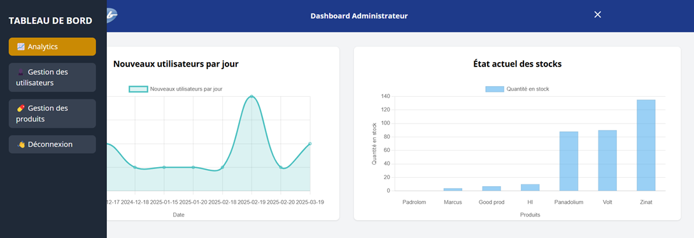
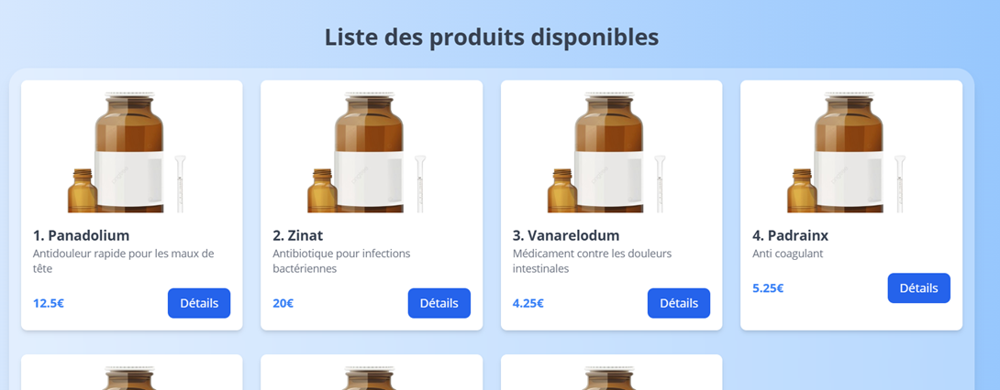
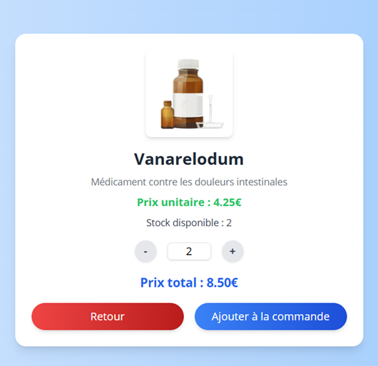
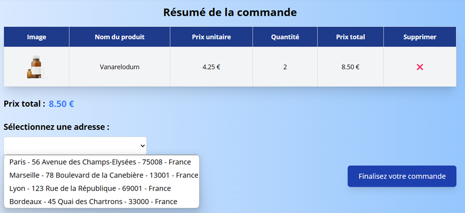
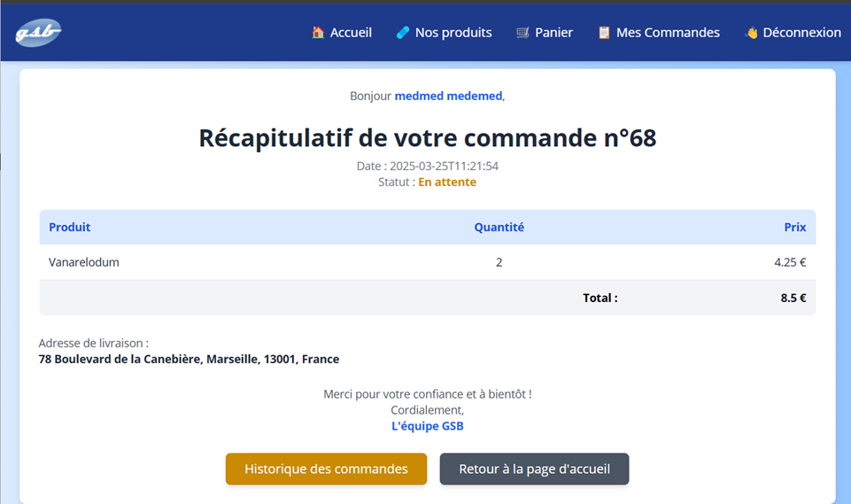
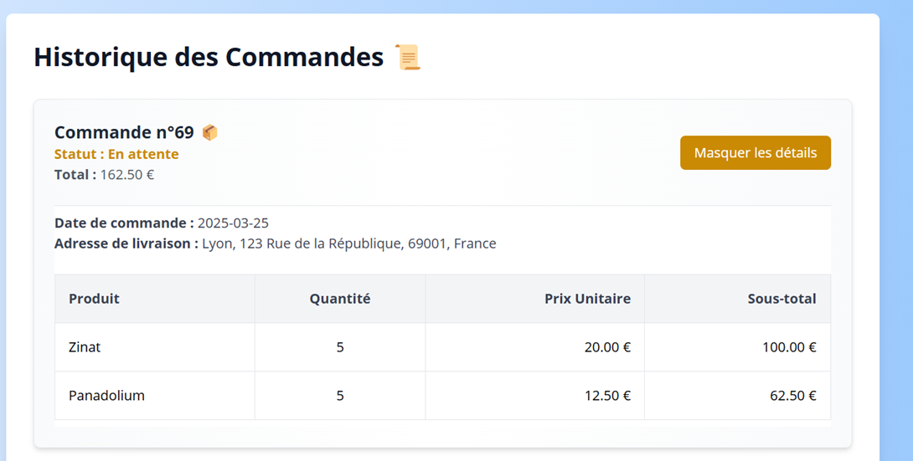
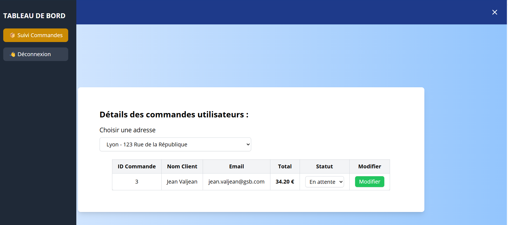

# 🌟 Projet GSB Front (Headless) 🌟

Bienvenue dans le projet **GSB Front (Headless)** ! Ce projet utilise **Vue.js** avec **TailwindCSS** pour le frontend et suit une architecture modulaire et bien organisée. 🚀

---

## 🧭 Sommaire
- [📁 Structure du projet](#-structure-du-projet)
- [📖 Répertoires](#-répertoires)
- [🪬Fichier importants](#-fichiers-importants)
- [🚀 Installation](#-installation-et-lancement)
- [🐳 Docker](#-docker-)
- [📸 Apercu du projet](#-apercu-du-projet)
- [✨ Fonctionnalités](#-fonctionnalités-principales)
- [📚 Technologies utilisées](#-technologies-utilisées)
- [📦 Backend](#-backend)

---

## 📁 Structure du Projet

Voici un aperçu de la structure principale du projet :

### 🗂️ Répertoires

- **`src/assets`** : Contient les ressources statiques.
    - 📷 `images` : Images pour le frontend.
    - 🎨 `styles` : Fichiers CSS/Tailwind personnalisés.

- **`src/components`** : Composants réutilisables.
    - **`common`** : Composants communs (ex. footer, CGU, etc.).
    - **`dashboardComponent`** : Composants spécifiques au tableau de bord.
    - **`medicalEmployeeComponent`** : Composants dédiés aux employés médicaux.

- **`src/router`** : Fichiers de configuration des routes.
    - 🔄 `admin.js`, `salesperson.js`, etc.

- **`src/services`** : Gestion des appels API (Ex. utilisateurs, produits, commandes).

- **`src/views`** : Pages principales par rôle :
    - 👑 `admin` : Pages pour les administrateurs.
    - 💼 `medical-employee` : Pages pour les employés médicaux.
    - 🛒 `salesperson` : Pages pour les commerciaux.

### 📄 Fichiers Importants

- **`App.vue`** : Point d'entrée principal de l'application.
- **`tailwind.config.js`** : Configuration personnalisée de TailwindCSS.
- **`vite.config.js`** : Configuration de Vite pour le bundling.

---

## 🚀 Installation et Lancement

1. **Cloner le dépôt** :
   ```bash
   git clone <https://github.com/CyrilUO/GSB-ECOMMERCE-FRONT.git>
   cd gsb_front

2. **Installer les dépendance** :
    ```bash
    npm install

3. **Lancer le projet en mode développement** :
    ```bash
    npm run dev

---

## 🐳 Docker 
Le projet Docker est en cours d’intégration.
Pour l’instant, l’exécution se fait en local via npm run dev.

---

## ✨ Fonctionnalités Principales

- 🖥️ **Dashboard Administrateur** : Gestion intuitive pour les administrateurs.
- 🧑‍⚕️ **Espace Employé Médical** : catalogue, panier, commande rapide
- 💼 Espace Commerciaux : suivi des commandes par région
- 📊 **Analytique** : Affichage de graphiques dynamiques.
- 🔐 **Authentification** : Via JWT avec gestion des rôles (Admin, Employé Médical, Commerciaux).

---

## 📸 Apercu du projet

| Page                        | Aperçu                                            |
|-----------------------------|---------------------------------------------------|
| 📊 Dashboard Administrateur |        |
| 🏠 Accueil Employé Médical  |    |
| 💊 PLP                      |            |
| 🔍 PDP                      |            |
| 🛒 Cart                     |           |
| 💳 Order Recap              |     |
| 📋 OrderHistory             |   |
| ‍💼 Salesperson             |  |


---

## 📚 Technologies Utilisées

- **Vue.js** : Framework JavaScript moderne.
- **TailwindCSS** : Styles CSS utilitaires pour une conception rapide.
- **Vite** : Outil de build ultra rapide.
- **Node.js** : Gestion des dépendances.

---

## 📦 Backend
Le backend Spring Boot est hébergé dans un dépôt séparé.
🔗 Consultez le README côté backend pour plus d'infos sur la configuration (normalement déjà fait si vous êtes arrivé jusqu'ici ! ;) )

